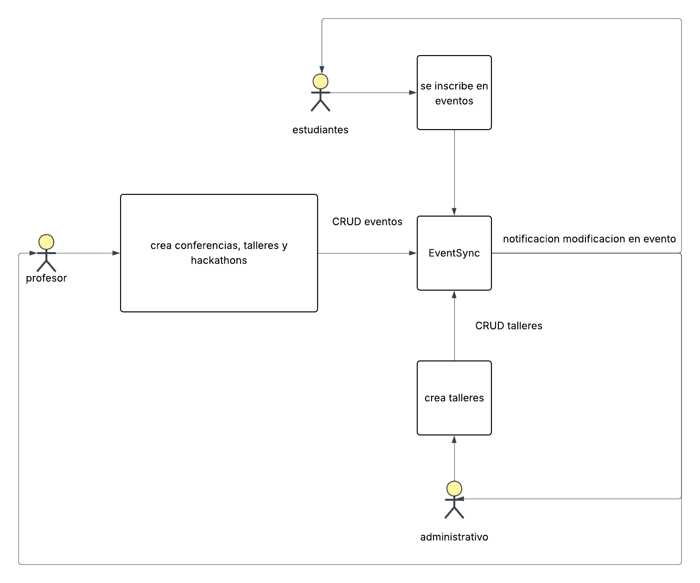

# DOSW_ParcialT1_JuanNeira
repositorio para el parcial del primer semestre de dosw

# Primer punto 
1. Realice el diagrama de contexto con las generalidades de su sistema.
(Añadirlo al README.md)

factory mediator

creacional comportamiento
# segundo punto
2. Identifique 2 patrones de diseño que puedan aplicarse al caso de estudio,
especificando por cada uno:
a. Nombre del Patrón
b. Tipo de patrón (creacional, estructural o de comportamiento).
c. Justificación de la decisión.

1a. factory 
1b. creacional
1c. todos los eventos tienen una base en comun la cual es duracion, participantes, creador, etc pero cada uno tiene unas reglas aparte las cuales cada tipo de evento las implementa de una manera diferente como lo puede ser los requisitos para la inscripcion de un participante por esto ultimo se usa este patron 

2a. mediator
2b. comportamental
2c. se usa mediator para poder facilitar el codigo a la hora de manejar el comportamiento de los componentes del programa pues todo tienen reglas de negocio diferentes las cuales si se intentan codificar todas por aparte sin un mediador muchos de los componentes causan caos en el programa por lo cual el mediador nos ayudara a manejar este caos que se puede generar
 